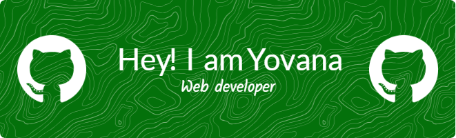

## Hello world 👋

<!--
**GIyouu/GIyouu** is a ✨ _special_ ✨ repository because its `README.md` (this file) appears on your GitHub profile.

Here are some ideas to get you started:

-->
🎓 Informatics student | 💻 Learning Web  
🚀 Building projects and exploring tech  
✨ Believer in growth & purpose

 <h3 align="center">Hi 👋, I'm Yovana</h1>
<h4 align="center">I am a student who is passionate about becoming a Full-Stack Developer. Currently learning web development and building real-world projects to sharpen my skills</h3> 

<h4 align="left">Languages and Tools:</h3>

   
  
 
 
 
 

<h3 align="left">Play  with me</h3>

###

<picture>
  <source media="(prefers-color-scheme: dark)" srcset="https://raw.githubusercontent.com/GIyouu/GIyouu/output/pacman-contribution-graph-dark.svg">
  <source media="(prefers-color-scheme: light)" srcset="https://raw.githubusercontent.com/GIyouu/GIyouu/output/pacman-contribution-graph.svg">
  
</picture>

###